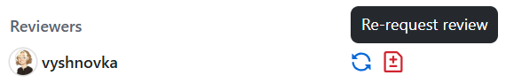

# :rocket: Contribution Protocol :rocket:

The foundation for smooth merges and stable main.


## Content
- [Branch Basics](#branch-basics)
- [Pull Requests](#pull-requests)
- [Review Process](#review-process)
  - [For Reviewee (Assignee)](#for-reviewee-assignee)
  - [For Reviewer](#for-reviewer)
- [Merging](#merging)


## Branch Basics
Remember: **NEVER COMMIT DIRECTLY TO MAIN**. :no_entry:  
- To contribute, always create a new branch off the latest main, then commit your changes and make a Pull Request (PR).
- Branch naming structure should contain your name and the purpose of the branch divided by slash. E.g. `victoria/platform-refactoring` or `benjamim/graphics`.
- Commit changes as often as you feel reasonable, but keep them logical and focused (no one-symbol fixes or 10GB dumps all at once).
- Try to avoid committing non-working code, even if you plan to fix it in the next commit.
- There are no strict rules about commit name/description, however the recommendation is to keep it short and understandable.

## Pull Requests
- Rebase feature branch on top of main and resolve all the conflicts (if exist), then force-push.
```
git checkout your-branch
git fetch origin
git rebase origin/main
git push --force
```
- Fill out PR description according to provided template.
- Assign yourself as the author (reviewee).
- Request review from [@vyshnovka](https://github.com/vyshnovka), your direct supervisor, or someone familiar with the changed part of the project.

## Review Process

### For Reviewee (Assignee)
- Address all comments from all reviewers before merging. 
- *Not necessarily, but highly appreciated:* mark comments as addressed by replying with "Done." or simply reacting with an emoji (e.g. :+1:).
- If the change will not be made (or the comment was a question/suggestion), respond with a reasonable explanation.
- Do not resolve conversations yourself - the reviewer does that.
- Once all comments are addressed, re-request review from the relevant person.



- A couple of iterations might be required to have a decent PR. Keep re-requesting the review until you get an approval.

### For Reviewer
- Leave clear and constructive feedback on all added/changed code.
- Only resolve conversations when the change is fully addressed or the response is satisfactory.
- Approve when the PR is ready to be merged, not in advance.


## Merging
Merging in our case is the process of combining your newly added code with the working code of the product.  

The reviewee (assignee) is responsible for merging. PR can be merged ONLY when:
- All conversations are resolved by reviewers (or an agreement has been reached).
- Approvals from every reviewer who left comments is given and no unreviewed changes are made.
- Branch is 0 commits behind main (if not - rebase).

Corresponding feature branch will be deleted automatically after successful merge.
